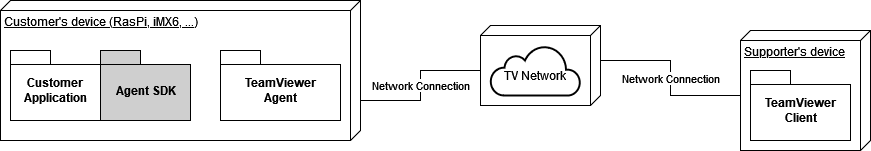
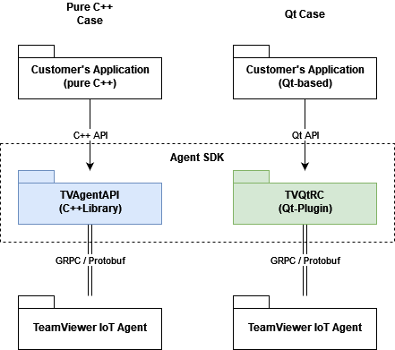

# TeamViewer Agent SDK

## Introduction

On embedded systems, the TeamViewer IoT Agent provides many of the same features you can find on desktop editions of TeamViewer:

* Viewing the remote screen
* Sending keyboard and mouse input
* Accessing the remote file system
* Requesting remote assistance
* Exchanging chat messages, etc.

In addition, the TeamViewer IoT Agent provides the ability to outsource some or all of this functionality to an **external application**.

On your particular embedded system, you may want to:

* Use a more efficient or system-specific way to grab the screen
* Grab only a single window instead of the whole screen
* Supply an arbitrary image feed altogether
* Filter, modify, or log keyboard and mouse input
* Allow or deny incoming connections, attempts to access the file system, etc.



The TeamViewer Agent SDK enables your application to connect to the TeamViewer IoT Agent process running on the same machine, and then provide your own implementations for these features. By loading a dynamic library, your application can talk to the IoT Agent, make requests and receive replies, send picture data, change settings, and set up callbacks for events that interest you. Under the hood, your app talks to the IoT Agent through IPC over Unix domain sockets.

## Ways to use the SDK:



### **C++ API**

New and modular, this aims to provide a clean, structured interface. In active development; currently offers a limited set of features compared to the Qt API.

* Source: [TVAgentAPI/](TVAgentAPI/)
* Build artifact: `libTVAgentAPI.so`
* Simple command-line example apps: [examples/](examples/).

### **Qt API**

Designed for direct integration into Qt apps running on the device. You can pass native types (`QString`, ...), use the Qt framework to grab snapshots of your window and simulate input, etc.

* Source: [TVQtRC/](TVQtRC/)
* Build artifact: `libTVQtRC.so`
* A fully featured Qt example application: [app/](app).

### **Communication Layer API**

For experienced users. The underlying layer used by the C++ and Qt APIs to send and receive raw IPC packets (through an intermediate helper object). Broken down into individual directories per component. Each produces its own `.a` static library your application can selectively link to.

* Source: [CommunicationLayer/](CommunicationLayer/)
* Build artifacts: one per component, e.g. `AccessControlService/Library/libAccessControlService.a`
* Example usage can be found in the intermediate helper object: [TVAgentAPIPrivate/](TVAgentAPIPrivate/).

## Python Bindings

A Python wrapper around the C++ API is also available at [Bindings/Python](./Bindings/Python/), providing a 1:1 correspondence with the C++ counterpart. Users who prefer the convenience of Python can refer to the example scripts provided.

## System Requirements

Currently only Linux-based OSs are supported.

### **Development**

On Debian systems, you will need the following development packages:

* `cmake`
* `build-essential` or `g++`
* `libgrpc++-dev`
* `protobuf-compiler-grpc`
* `libprotobuf-dev`
* `protobuf-compiler`

If you plan to use the Qt API, you will also need:

* `qtbase5-dev`
* `qtdeclarative5-dev`

### **Deployment**

Depending on your build configuration, you may need to install the following libraries on the target system (tested on Debian 10):

* Google Protocol Buffers library (3.0 or newer)
* Google gRPC library (1.16 or newer)
* zlib (needed by gRPC)
* Qt 5 (5.3 or newer)

### System Requirements

* For supported platforms see https://www.teamviewer.com/link/?url=150157
* At least 200 MB free disk space
* Systemd software suite
* Glibc-utils package (version 2.17 or higher)
* Linux 2.6.27 kernel

### IoT Agent version

To use the full functionality set of the C++ API, you need IoT Agent version 2.21.13 or higher. Prior versions of the Agent do not fully support the Session Management feature (session start/stop notifications, enumerating running sessions).

The functionality set of the Qt API is not affected.

## Building and Setup

### Steps to build

```bash
# create and navigate to a build directory
mkdir build
cd build

# run CMake
cmake <path-to-source>/

# run make
make
```

Building the package will produce the following binaries (depending on the configure options used):

Libraries:
* `libTVAgentApi.so` : The C++ API shared library
* `libTVQtRC.so` : The Qt API shared library
* `CommunicationLayer/src/<Xyz>/Library/lib<Xyz>.a` : Individual IPC-level components.

Example Applications:
* `examples/example_<Abc>` : The C++ API example apps (command line)
* `qt_simulate` : The Qt API example app (GUI)

### Configure options

Disable building the Qt API + example app:

```bash
cmake -DENABLE_QT_PLUGIN=OFF <path-to-source>/
```

Enable building the Python bindings:

```bash
cmake -DENABLE_PYTHON_MODULE=ON <path-to-source>/
```

### Installation for development

You can install the SDK for use in a development environment:

```bash
# default installation
make install
```
This will install the `.so` and `.a` files (by default to `/usr/local`), along with the public header files needed to use them (`/usr/local/include/*.h`).

To install the SDK to a custom location, override `CMAKE_INSTALL_PREFIX` before building:

```bash
# configure to install into custom prefix
cmake -DCMAKE_INSTALL_PREFIX=<custom-install-path> <path-to-sources-root>
```

### Configuration

At installation time, the IoT Agent creates a system group called `tv_api`. An application that wishes to communicate with the Agent must run as a user that is part of this group:

```bash
# add current user to tv_api group
usermod -a -G tv_api $USER
```

If your application wants to handle screen grabbing and receive keyboard/mouse input, the IoT Agent needs to be configured accordingly (this functonality in the Agent is off by default):

```bash
teamviewer-iot-agent configure set EnableRemoteScreen 1
```

The Agent can grab the screen by itself, or rely on your external app to provide screen updates. This is controlled by the `RemoteScreenChannels` property.

### Agent built-in grabbing

Learn about the various channel configurations available: https://www.teamviewer.com/link/?url=710439

### External app-assisted grabbing

#### External app grabs screen data and sends to Agent:

```bash
teamviewer-iot-agent configure set RemoteScreenChannels 'EAP'
```

#### External app notifies Agent when screen has changed; Agent then grabs screen:

```bash
teamviewer-iot-agent configure set RemoteScreenChannels 'EAP:FBPush'
```

#### External app is not involved; Agent grabs screen:

```bash
teamviewer-iot-agent configure set RemoteScreenChannels 'EAP:FBPull'
```

👉 The IoT Agent will default to the first Linux framebuffer device, usually `/dev/fb0`. You can specify a custom device with `FBPush` or `FBPull`:

```bash
teamviewer-iot-agent configure set RemoteScreenChannels 'EAP:FBPush:/dev/fb42'
```

#### [Wayland-specific] External app displays running session indicator; Agent grabs screen

```bash
teamviewer-iot-agent configure set RemoteScreenChannels 'EAP:WL:/run/user/1000/wayland-0'
```

## Creating Access Tokens for Instant Support

In order to request Instant Support, your application will need an access token (such as `"12345678-LgxKf0bybuAESdNIelrY"`) which uniquely identifies the remote supporter (Note: not a TeamViewer ID). A supporter will create such tokens under their account and communicate them to you.

As a supporter:

* Navigate to https://login.teamviewer.com/
* Log in to your account
* In the upper right corner, click the dropdown box with your name and select "Edit profile"
* In the "Profile settings" list, select "Apps"
* In the section that opens, click "Create script token"
* In the menu that opens, enter a name for your token (e.g., "My Instant Support Token") and an optional description
* Open the "Session management" dropdown and check all boxes
* Click "Create"
* Open the newly created script token, copy the string value, and communicate it to your users or embed it into your application.

## Links & References

By using the Agent SDK you also accept the TeamViewer IoT EULA. Please find the full version of the IoT EULA here => http://www.teamviewer.com/link/?url=653670

You can also check our documentation space for further information => https://www.teamviewer.com/link/?url=362507

## License

For licensing information see [LICENSE](./LICENSE).

## Author

TeamViewer Germany GmbH https://www.teamviewer.com/en/support/contact
