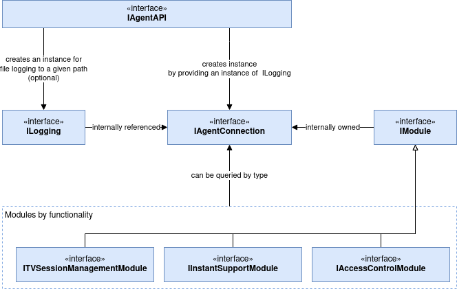

TV Agent API Description
========================================

## Introduction
The TV Agent API provides an interface for integrating the TeamViewer IoT Agent's functionality into a C++ application. This document describes the fundamental concepts of the API to provide a better understanding of its structure and how it can be used.

## Agent Connection
AgentConnection represents a connection to a local TeamViewer IoT Agent. It is used to initiate actions and provide information about the connection status. Once a connection to a running TeamViewer IoT Agent has been established, the connection is maintained and re-established in case of a disconnect, until explicitly closed. API users can register callbacks to get notifications about connection status changes. AgentConnection provides modules (described in [Modules](#modules)) exposing various features of the TeamViewer IoT Agent. It also allows the processing of pending events, explained in more detail in [Event Dispatching](#event-dispatching) and [Callback Object](#callback-object)

## Modules
Modules are used to interact with the TeamViewer IoT Agent. Depending on their type they expose access to different features of the TeamViewer IoT Agent.

#### **TVSessionManagementModule**
The SessionManagementModule is used to monitor incoming connections to the local TeamViewer IoT Agent. API users can register callbacks to get notified when a session to the running IoT Agent is established or ended, and to get the total count of currently active sessions. Users can also terminate currently active sessions.

#### **AccessControlModule**
The AccessControlModule is used to manage the permissions of certain features on the TeamViewer IoT Agent (FileTransfer, RemoteView, RemoteControl). Access permissions for these features can be set to `Allowed`, `Denied`, or `AfterConfirmation` on a per-feature basis. Callbacks can be registered to handle incoming access requests. Note that permissions are only taken into account once a new session starts. Changing permissions during an active session will only affect future sessions.

#### **InstantSupportModule**
The InstantSupportModule is used to open service cases for remote assistance from a remote supporter. An instant support request created this way shows up in the supporter's TeamViewer client GUI as a separate entry in the Computers & Contacts list, as well as on the [Management Console](https://login.teamviewer.com). The supporter can then request to connect to the supportee's machine, send and receive chat messages, and more.

## Logging
The Agent API provides the option to pass a logger object with the creation of an AgentConnection. The API can create a default file logger you can use for this purpose, or you can implement your own custom logger that implements the ILogging interface.

## Lifetime
To keep the API clean and avoid memory management concerns, raw pointers are used at the app-API boundary. This means pointers need to be destroyed manually by the developer at the appropriate time. As such it is important to keep in mind the lifetime of the different API components.

The most critical object that is managed by the developer is the AgentConnection. The AgentConnection provides and manages the modules described in the previous section, therefore modules are destroyed at the end of the AgentConnection's lifetime. Modules must not be used beyond that point and any pointers to modules held by the application should be deleted.

It is also important to note that the lifetime of a logger passed to an AgentConnection must always exceed the lifetime of the connection.

## Callback Object
Most API objects allow setting callbacks for important events. The Callback object used for this purpose is in the vein of C-style callbacks and consists of a global function pointer and a `void* userdata` pointer that can be used for any purpose, e.g. as a context pointer. The calling of registered callbacks is internally handled by an event dispatcher. Its general concept is described in the following paragraph.

## Event Dispatching
The event dispatching is handled in a "lazy" fashion, meaning all events are added to a queue and stay pending until `processEvents()` in the AgentConnection is called. Once called, all pending events are executed in the order they were issued and any previously set callbacks are called. When calling `processEvents()` and no events are pending, a wait time for the next event to arrive can be optionally specified.

It should be noted that the API and event dispatching are not thread safe.
