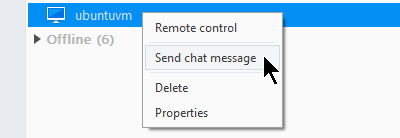

# C++ API example apps

## **Building and running the examples**

Follow the `Building and Setup` steps from [the main README file](../../README.md):

```bash
# create and navigate to a build directory
mkdir build
cd build

# run CMake
cmake <path-to-source>/

# run make
make
```

You can also `make` individual examples if you wish:

```bash
make example_AgentConnection
```

The newly created `examples/` directory will contain the four apps you can run:

>`example_AgentConnection`  
`example_SessionManagement`  
`example_AccessControl`&nbsp;&nbsp;&nbsp;&nbsp;&nbsp;&nbsp;&nbsp;&nbsp;&nbsp;&nbsp;&nbsp;&nbsp;&nbsp;(accepts command-line arguments; run with `-h` for details)  
`example_InstantSupport`&nbsp;&nbsp;&nbsp;&nbsp;&nbsp;&nbsp;&nbsp;&nbsp;&nbsp;&nbsp;&nbsp;(accepts command-line arguments; run with `-h` for details)  

Continue reading for an architectural breakdown of each application and the meaning of their command-line arguments.

## **Basic example: Agent Connection**

This example shows the steps for creating and maintaining a connection to the TeamViewer IoT Agent process running on your local machine.

See source: [AgentConnection/main.cpp](AgentConnection/main.cpp)

## Step 1: Get a pointer to the API object

```C++
tvagentapi::IAgentAPI* agentAPI = TVGetAgentAPI();
```

Note we are using raw pointers at the app-API boundary. This keeps the API clean and avoids memory management concerns between your app and the Agent API shared library. Remember to destroy your pointers manually at the appropriate time (see below).

## Step 2: Create a logging object (optional)

```C++
tvagentapi::ILogging* logging = agentAPI->createFileLogging("example.log");
```

As shown above, you can ask the Agent API to create a default logging object for you. This will log to a file, which is adequate for most cases. You are also free to create your own logger that implements the `tvagentapi::ILogging` interface.

## Step 3: Get a connection to your local TeamViewer IoT Agent

```C++
tvagentapi::IAgentConnection* agentConnection = agentAPI->createAgentConnectionLocal(logging);
```

As mentioned, providing the `logging` object is optional but useful for debugging.
Note: at this stage the connection is created, but not yet active.

## Step 4: Set the connection callback

```C++
agentConnection->setStatusChangedCallback({connectionStatusChanged, nullptr/*userdata*/});
```

You can ask the connection object to notify you of changes: a successful connection to the IoT Agent, connection lost, etc.

👉 Your app (through the Agent API) makes requests to the IoT Agent process by pushing packets to its Unix sockets. In turn, the IoT Agent may asynchronously reply by pushing packets to *our* Unix sockets. (In this sense, your app is both a "client" and a "server".) Packets are serialized using [Protocol Buffers](https://developers.google.com/protocol-buffers) and sent using [GRPC](https://grpc.io/).

Most objects let you set callbacks for important events that happen to them. Notice the layout of the `Callback` object we use:

* a global function pointer, and
* a `void* userdata` context you can use for any purpose.

 This is again because we use raw pointers across the API boundary. You will see more examples of setting callbacks below.

## Step 5: Start the connection

```C++
agentConnection->start();
```

This launches a background thread that:
* initializes the various client and server sockets on the API side
* handshakes with the IoT Agent process, and
* runs a keepalive ping loop.

You are now connected to the IoT Agent. You can initiate actions and react to events.

## Step 6: Run the event loop

```C++
printf("Monitoring connection status changes... Press Ctrl+C to exit\n");
while (!s_isInterrupted)
{
    agentConnection->processEvents();
}
```

The first event you should get is a call to your `connectionStatusChanged()`, with the status `Status::Connecting`, followed by another with `Status::Connected` if all goes well.

In our basic example app, this is all that happens (aside from an unfortunate `Status::ConnectionLost`). You can stop the event loop at any time. Here, we break on `Ctrl-C`.

## Step 7: Shutdown and cleanup

```C++
agentConnection->stop();
```

This sends the IoT Agent process a "disconnect" request and terminates the background API thread.

It's a good idea to handle any leftover events that `stop()` itself may have generated:

```C++
agentConnection->processEvents();
```

Manually free any allocated objects. Note: if you allocated an object through the Agent API, you should also free it through the Agent API. Don't `free()` or `delete` such pointers directly.

```C++
agentAPI->destroyAgentConnection(agentConnection);
...
agentAPI->destroyLogging(logging);
```

(Of course, if the `logging` object was your own, you would free it by your own means.)

To more meaningfully use the Agent API to interact with the IoT Agent, we need to use API modules.

## **Module example #1: Session Management**

See source: [SessionManagement/main.cpp](SessionManagement/main.cpp)

👉 A "session" is any incoming connection to your local IoT Agent. You can use the Session Management module to monitor these connections.

Create the Session Management module:

```C++
tvagentapi::ITVSessionManagementModule* tvSessionManagementModule =
    tvagentapi::getModule<tvagentapi::ITVSessionManagementModule>(agentConnection);
```

It is a good idea to check whether the module was successfully created and is supported:

```C++
if (!tvSessionManagementModule)
{
    fputs("Failed to create TVSessionManagementModule\n", stderr);
    return EXIT_FAILURE;
}
...
if (!tvSessionManagementModule->isSupported())
{
    fputs("TVSessionManagementModule not supported\n", stderr);
    return EXIT_FAILURE;
}
```

👉 In rare cases, you may find yourself running on a system with a version of the IoT Agent that doesn't support a particular module (or the IoT Agent may have been downgraded while your app is running). You will still be able to create and interact with the module, but most methods &ndash; other than `isSupported()` &ndash; will be no-ops.

Set the module-specific callbacks:

```C++
tvSessionManagementModule->setCallbacks({
        {sessionStartedCallback, tvSessionManagementModule},
        {sessionStoppedCallback, tvSessionManagementModule}
    });
```

👉 Unlike the `agentConnection` object which has only one callback, modules typically have several. Look at the definition of `<YourModule>::setCallbacks()` to see what callbacks it expects, and in what order.

(You can provide an empty `Callback` object `{}` for any event you are not interested in.)

The event loop then runs as usual:

```C++
while (...)
{
    agentConnection->processEvents();
}
```

You will now receive callbacks when an incoming session to your IoT Agent is established:

```C++
void sessionStartedCallback(tvagentapi::ITVSessionManagementModule::TVSessionID tvSessionID, int32_t tvSessionCount, void* userdata)
{
    printf("[TVSessionManagementModule] Session Started: id %d (session count %d)\n",
        tvSessionID, tvSessionCount);
    ...
}
```

* `tvSessionID` : a numerical identifier of the newly connected session. Note: this is **not** a TeamViewer ID. If the same remote user connects, disconnects, then connects again, you will see different `tvSessionID`s.
* `tvSessionCount` : the number of currently connected sessions, including this one. Typically 1, but can conceivably be any number.

You will also receive callbacks when a session ends:

```C++
void sessionStoppedCallback(tvagentapi::ITVSessionManagementModule::TVSessionID tvSessionID, int32_t tvSessionCount, void* userdata)
{
    printf("[TVSessionManagementModule] Session Stopped: id %d (session count %d)\n",
        tvSessionID, tvSessionCount);
    ...
}
```

* `tvSessionID` : the numerical identifier of the disconnected session.
* `tvSessionCount` : the number of currently connected sessions. Goes to 0 when the last session ends.

As always, remember to clean up your API resources:

```C++
agentAPI->destroyTVSessionManagementModule(tvSessionManagementModule);
agentAPI->destroyAgentConnection(agentConnection);
agentAPI->destroyLogging(logging);
```

## **Module example #2: Access Control**

See source: [AccessControl/main.cpp](AccessControl/main.cpp)

👉 Some features provided by the IoT Agent (`FileTransfer`, `RemoteView`, `RemoteControl`) have permissions associated with them:
* `Allowed` : a remote TeamViewer client connected to this IoT Agent can use the feature.
* `Denied` : the remote client cannot use the feature.
* `AfterConfirmation` : the remote client can use the feature **after** asking for permission. Your app will get a callback from the Agent API, at which point it can show a UI prompt, programmatically make the decision, etc.

You can use the Access Control module to manage these permissions on a per-feature basis, as well as handle any incoming access requests.

(Note: Permissions are only taken into account once, when a new session starts. Changing permissions during an active session will only affect future sessions.)

Create the Access Control module:

```C++
tvagentapi::IAccessControlModule* accessControlModule =
    tvagentapi::getModule<tvagentapi::IAccessControlModule>(agentConnection);
```

As usual, it's good to do some sanity checks:

```C++
if (!accessControlModule) ...
if (!accessControlModule->isSupported()) ...
```

Set the callbacks:

```C++
accessControlModule->setCallbacks({
    {accessChanged, nullptr/*userdata*/},
    {accessConfirmationRequested, accessControlModule},
});
```

* `accessChanged()` : Someone (possibly your app) has changed an access permission on the IoT Agent for a particular feature; for example, `FileTransfer` was set to `Allowed`. (Note: only called when the value has actually changed.)
* `accessConfirmationRequested()` : A remotely connected TeamViewer client wants to use a feature which is currently set to `AfterConfirmation`. Your app must take the steps to allow or deny the request (by prompting the user, deciding programmatically, etc.). If you do nothing, the request will time out on the remote client's side after a few minutes.

Set and get access permissions for specific features:

```C++
bool success = accessControlModule->setAccess(
    tvagentapi::IAccessControlModule::Feature::RemoteControl,
    tvagentapi::IAccessControlModule::Access::AfterConfirmation);
```

```C++
tvagentapi::IAccessControlModule::Access access;
bool success = accessControlModule->getAccess(
    tvagentapi::IAccessControlModule::Feature::FileTransfer,
    access);
)
```

When a particular feature is set to `AfterConfirmation`, you can decide whether to allow a remote party to use it:

```C++
void accessConfirmationRequested(
    tvagentapi::IAccessControlModule::Feature feature,
    void* userdata) noexcept
{
    auto accessControlModule = static_cast<tvagentapi::IAccessControlModule*>(userdata);

    printf(
        "Incoming access confirmation request. Access to %s requested.\n"
        "Confirm Access control request? (y/N): ",
        tvagentapi::toCString(feature));

    switch (getchar())
    {
        case 'y':
        case 'Y':
            accessControlModule->acceptAccessRequest(feature);
            printf("Access confirmation request accepted\n");
            break;
        default:
            accessControlModule->rejectAccessRequest(feature);
            printf("Access confirmation request rejected\n");
            break;
    }
}
```

## **Module example #3: Instant Support**

See source: [InstantSupport/main.cpp](InstantSupport/main.cpp)

👉 TeamViewer users have the ability to request remote assistance from other users. This shows up in the supporter's TeamViewer client GUI as a separate entry in the Computers & Contacts list. The supporter can then request to connect to the supportee's machine, send and receive chat messages, etc. This functionality is of course also available in the TeamViewer IoT Agent, and reflected in the Agent API.

Create the Instant Support module and set the callbacks:

```C++
tvagentapi::IInstantSupportModule* instantSupportModule =
    tvagentapi::getModule<tvagentapi::IInstantSupportModule>(agentConnection);
...

instantSupportModule->setCallbacks({
        {instantSupportSessionDataChanged, nullptr/*userdata*/},
        {instantSupportRequestError, nullptr/*userdata*/},
        {instantSupportConnectionRequested, instantSupportModule}
    });
```

Once connected to the IoT Agent, your app can make an Instant Support request:

```C++
void connectionStatusChanged(tvagentapi::IAgentConnection::Status status, void* userdata) noexcept
{
    ...
    if (status == tvagentapi::IAgentConnection::Status::Connected)
    {
        auto instantSupportModule = static_cast<tvagentapi::IInstantSupportModule*>(userdata);
        ...
        instantSupportModule->requestInstantSupport(
            accessToken,    // (see below)
            name,           // "Help me, Obi-Wan Kenobi"
            group,          // "Rebel Alliance"
            description,    // "You're my only hope"
            email,          // "leia@alderaan.org" [optional]
            sessionCode     // (see below)
        );
    }
}
```

- `accessToken` : an alphanumeric string (such as `"12345678-LgxKf0bybuAESdNIelrY"`) uniquely identifying the remote supporter (**not** a TeamViewer ID). You will typically already have this on hand for your application to use. Supporters can refer to **Creating Access Tokens for Instant Support** in [the main README file](../../README.md).
- `sessionCode` : a session identifier (such as `"s01-234-567"`) used to join or rejoin an existing instant support session. This is a long-running ID your supporter uses to keep track of your case, until they manually close it. You can think of it as a "service case number". Can be `""` on your first request.

👉 To request a new instant support session, you only need a valid `accessToken`. You will be called back in `instantSupportSessionDataChanged()` with the new `sessionCode`.

👉 To join an existing session (either created by you or the remote supporter), you need a valid `accessToken` and the correct `sessionCode`.

Once you are in an instant support session, the remote supporter may try to connect to you. This will prompt a call to your `instantSupportConnectionRequested()`, where you can allow or deny the incoming connection.

Note: a current limitation of the API is that an application can only make one Instant Support request.

## **Module example #4: Chat**

See source: [Chat/main.cpp](Chat/main.cpp)

TeamViewer users also have the ability to exchange chat messages. To initiate a conversation, users right click an entry in their Computers & Contacts list, and select "Send chat message".

👉 As a security precaution, the IoT Agent cannot initiate conversations, or look up conversations from past runs. You have to wait for an initial message from the outside.

**First things first: wait for an incoming message**

For the sake of demonstration, go ahead and send a friendly message from your TeamViewer desktop client to the machine running your IoT Agent...



If the Chat example app is running, you should see this (assuming the sender's name is indeed Chatty McChatterson):

```
[IChatModule] Chat created: { chatID: '25666256-4fcf-41c0-9971-7343680d96dc', title: 'Chatty McChatterson', chatEndpointID: 2032226623, chatEndpointType: 'Machine', chatState: 'Open' }

[IChatModule] New message in (currently active) chat ID 25666256-4fcf-41c0-9971-7343680d96dc:
Chatty McChatterson: Hello there!

Your message: 
```

Now stop the Chat example app (`Ctrl-C`) and run it again. Send a second message from your desktop client...

```
[IChatModule] New message in (currently active) chat ID 25666256-4fcf-41c0-9971-7343680d96dc:
Chatty McChatterson: Hey, where did you go?

Your message: 
```

Notice how the chat is not created this time: the ID is the same. The conversation is still active on the IoT Agent, and you can start sending replies right away.

👉 Each conversation with a remote party falls under a separate chat room (or simply "chat"). Chats are identified by string UUIDs, e.g. `"25666256-4fcf-41c0-9971-7343680d96dc"`.

The example program aims to be a complete chat application and is therefore quite extensive, but as you are already generally familiar with our SDK API, we'll just look at a few highlights. We create the Chat module and set the callbacks:

```C++
tvagentapi::IChatModule* chatModule =
    tvagentapi::getModule<tvagentapi::IChatModule>(agentConnection);
...

chatModule->setCallbacks({
    {handleChatCreated, nullptr},
    {handleChatsRemoved, nullptr},
    {handleChatClosed, nullptr},
    {handleNewMessages, nullptr},          // ReceivedMessagesCallback
    {handleMessageSendFinished, nullptr},  // SendMessageFinishedCallback
    {handleMessagesLoaded, nullptr},
    {handleHistoryDeleted, nullptr}
});
```

The most relevant is `ReceivedMessagesCallback`: incoming messages are delivered here. As soon as you get the first one, you can chat back:

```C++
tvagentapi::IChatModule::RequestID requestID =
    chatModule->sendMessage(chatID.c_str(), message.c_str());
```

`sendMessage()` returns an immediate numerical ID for your message; if the message is sent successfully, you will be called back asynchronously in `SendMessageFinishedCallback` with the same numerical ID, as well as a permanent string UUID for the message.

👉 Each individual message (both sent and received) is identified by a string UUID.

For completeness, the other Chat API calls are listed below. They interact only with the chat cache on your local IoT Agent: chats saved in the TeamViewer cloud are not affected. Refer to the example app for their usage.

```C++
obtainChats()    // get a list of available chats
loadMessages()   // load message history
deleteHistory()  // delete message history in a given chat
deleteChat()     // delete a chat altogether
```
